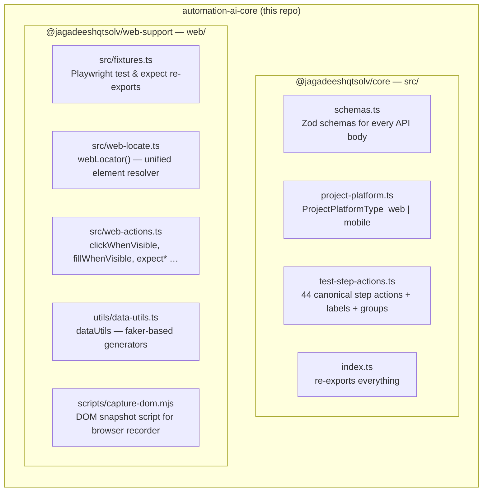
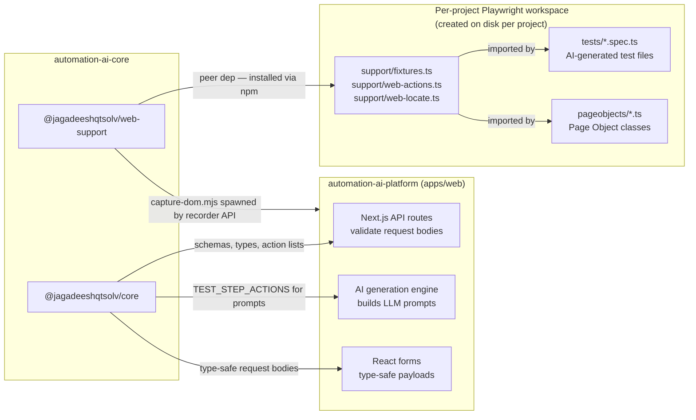
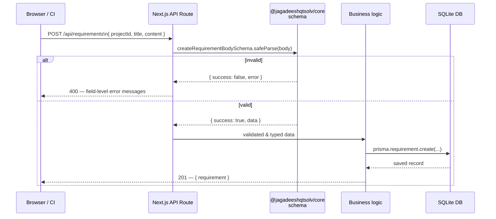
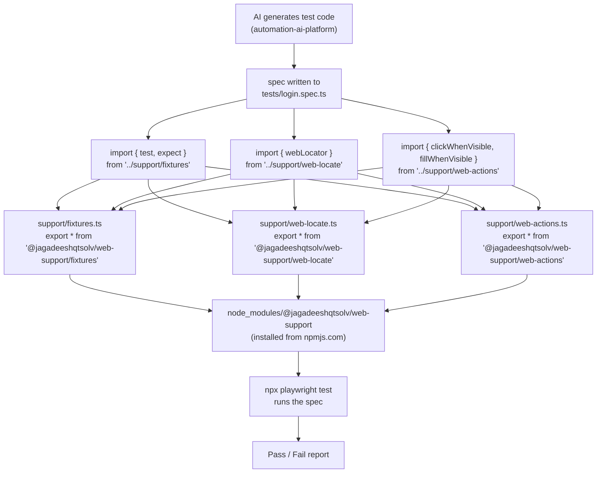
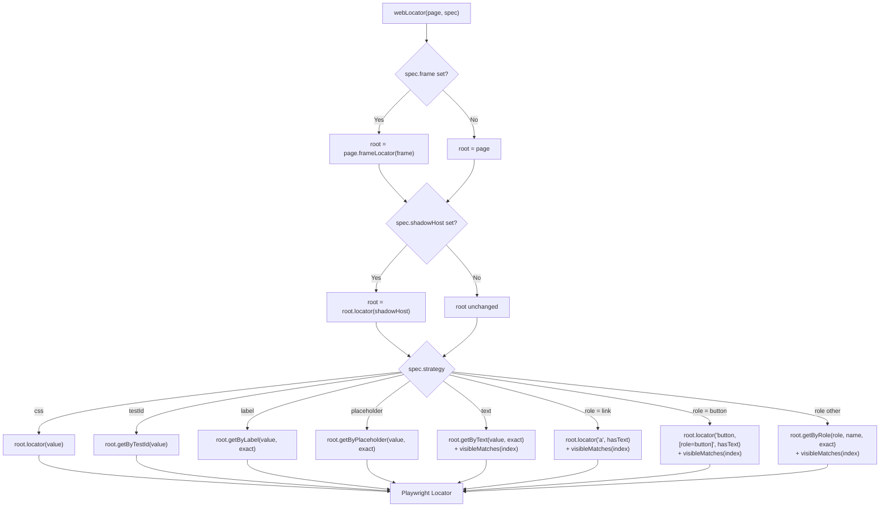
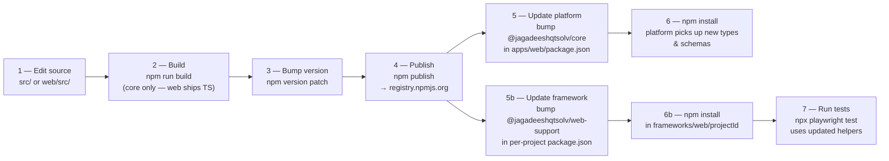

# automation-ai-core — Architecture & Package Diagrams

All diagrams use [Mermaid](https://mermaid.js.org/) and render natively on GitHub.

---

## Table of contents

1. [Package overview](#1-package-overview)
2. [How packages fit into the platform](#2-how-packages-fit-into-the-platform)
3. [Schema validation flow](#3-schema-validation-flow)
4. [Web-support in a Playwright test](#4-web-support-in-a-playwright-test)
5. [webLocator resolution logic](#5-weblocator-resolution-logic)
6. [Publish & consume lifecycle](#6-publish--consume-lifecycle)

---

## 1. Package overview

This repo contains two independently published npm packages that share a single source tree.

---

## 2. How packages fit into the platform

---

## 3. Schema validation flow

How a Zod schema defined here protects an API endpoint in the platform.

---

## 4. Web-support in a Playwright test

How helpers from `@jagadeeshqtsolv/web-support` are used in a generated test.

---

## 5. webLocator resolution logic

Internal decision tree inside `web-locate.ts` showing how a `WebLocatorSpec` resolves to a Playwright `Locator`.

---

## 6. Publish & consume lifecycle

How a change in this repo flows all the way to a running test.

